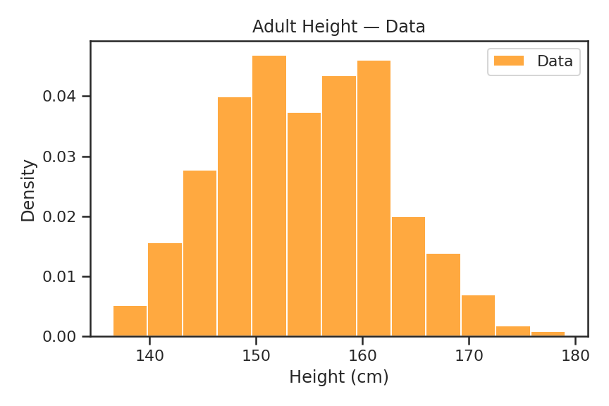
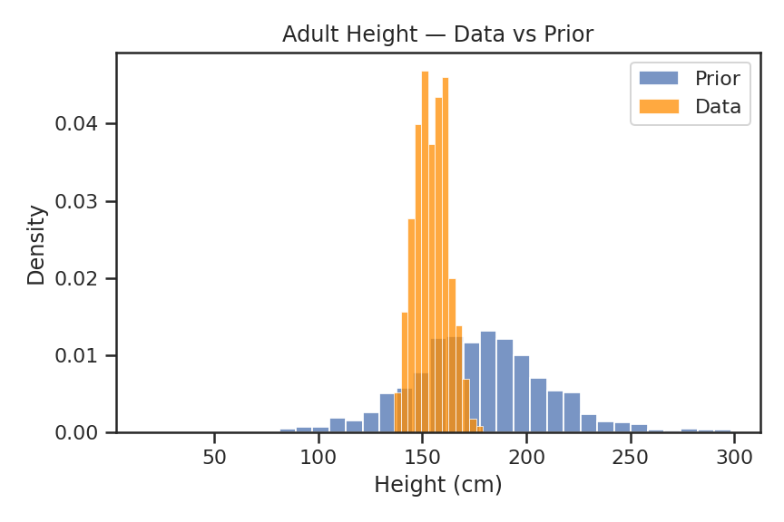
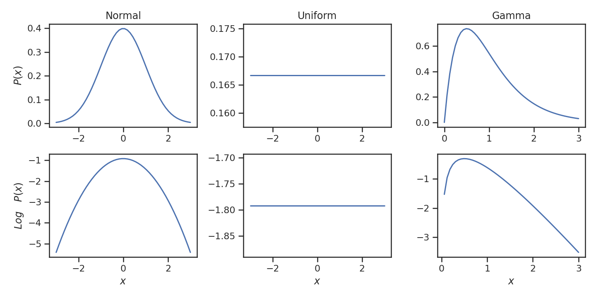
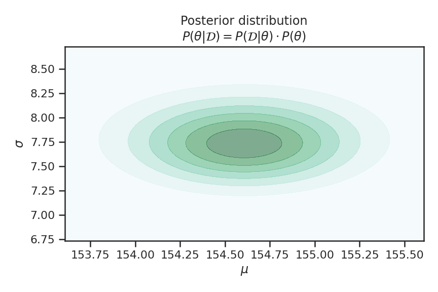

We are going to learn about bayesian probabilistic modeling by going through a simple example. Since we want to gain a firm understanding of the topic and its mathematical underpinnings, we will perform every step manually. If you'd like to follow along via code, you can use this [Colab notebook](https://colab.research.google.com/drive/1REwGPMOk_elQcalsqhKzqQ3WYizB_T37?usp=sharing).

<!-- Topics covered:
* Multivariate Gaussian
* MAP - *maximum a posteriori* 
* Gradient Decent
* Taylor Expansion
* Inverse of Covariance Matrix
* Hessian of Multivariate Gaussian
* Empirical second partial derivatives
* Quadratic Approximation
* Goodness of fit testing -->


### Table of Contents
```toc
# This code block gets replaced with the TOC
```

## Overview

[^kung]: The [!Kung](https://en.wikipedia.org/wiki/%C7%83Kung_people) are one of the San peoples who live near the Kalahari Desert in the southern part of Africa.

We're going to use a problem from [Statistical Rethinking](https://xcelab.net/rm/statistical-rethinking/) by Richard McElreath. In Chapter 4, he asks us to model the distribution of !Kung[^kung] adult heights. In the book, this is accomplished by using the library he provides and executing the code below.

```python
model = {
   'height': normal('mu', 'sigma'),
   'mu': normal(178, 20),
   'sigma': uniform(0, 50),
}
result = maximum_a_posteriori(model, data=df)
``` 
$$
\begin{array}{lrrrr}
 & \textbf{Mean} & \textbf{StdDev} & \textbf{5.5\%} & \textbf{94.5\%} \\ 
 \hline
 \textrm{mu}    & 154.61 & 0.41 & 153.95 & 155.27 \\ 
 \textrm{sigma} & 7.73 & 0.29 & 7.27 & 8.20 \\  
 \hline
\end{array}
$$

After running the library command, you are rewarded with the nice table above. From a practical standpoint, this is great, it's easy to use and abstracts away all of the low level details. However, when learning something new, I find that performing all the steps myself helps me gain an intuitive understanding of the topic. That's what this post is about, performing every step in as much detail as we can so we get both the results in the table and a firm grasp of where they came form.  

## Problem setup

### Data

We are provided with census data for the !Kung people, which contains a mix of adults and children. Filtering it to those who were at least 18 years old at the time leaves us with 352 data points. Inspecting the histogram in Figure \href{fig:adult-data-hist} shows that the data is roughly Gaussian.

\label{fig:adult-data-hist}




### Model

The first model that Richard has us use is a Gaussian with priors on both of it's parameters.

\label{eq:model-def}
$$
\tag{\ref{eq:model-def}}
\begin{aligned}
h_i &\sim N(\mu, \sigma) \\
\mu &\sim N(178, 20) \\
\sigma &\sim U(0, 50)
\end{aligned}
$$

From the data and what we know about the world, a mean height prior of `178` is a bit high. However, the flexibility provided by the standard deviation of `20` means that the model can still fit our data. It's also useful for illustrating how data can overcome incorrect priors so long as they are not too strong. We double check that our model is capable of describing the data by plotting samples from its prior distribution. We can see from Figure \href{fig:data-vs-prior-hist} that our data is within the bounds of our prior.

 \label{fig:data-vs-prior-hist}



**Modeling decision:** $\mathcal{M} = N(\mu, \sigma)$ and $\Theta = \{\mu, \sigma\}$ here we've decided to use a Gaussian model and to impose priors on it's parameters.

## Posterior

At this point, for better or worse, we've decided on [steps](#Steps) 1 - 4. Meaning we've made decisions on the data, model, and set of parameters we are going to consider when describing the height of the !Kung people. This reduces the space of our joint distribution in equation (1) to

$$
P(d, m, \theta)
$$

Step 5, the final step, is to select the parameters we use with our model. To do this, we need to isolate $\theta$ in equation (3). Using the [rules of probability](https://en.wikipedia.org/wiki/Joint_probability_distribution#Joint_density_function_or_mass_function), we can rewrite a joint distribution in terms of conditional distributions. The following are all equivalent

$$
\begin{aligned}
P(d, m, \theta) &= P(m | d, \theta) \cdot P(d, \theta) \\
                &= P(d | \theta, m) \cdot P(\theta, m) \\
                &= P(\theta | d, m) \cdot P(d, m)
\end{aligned}
$$

and we're going to use the first one so we can get rid of $m$ while we work to isolate $\theta$.

$$
\begin{aligned}
P(m | d, \theta) \cdot P(d, \theta) &= P(m | d, \theta) \cdot P(d, \theta) \\
\cancel{P(m | d, \theta)} \cdot P(\theta | d) \cdot P(d) &= \cancel{P(m | d, \theta)} \cdot P(d | \theta) \cdot P(\theta) \\
P(\theta | d) \cdot P(d) &= P(d | \theta) \cdot P(\theta)
\end{aligned}
$$

Dividing both sides by $P(d)$ will isolate $\theta$ and provide us with the formula we associate with "Bayes' rule".

\label{eq:bayes-rule}
$$
\tag{\ref{eq:bayes-rule}}
\overbrace{P(\theta | d)}^\text{Posterior} = \frac{\overbrace{P(d | \theta)}^\text{Likelihood} \cdot \overbrace{P(\theta)}^\text{Prior}}{\underbrace{P(d)}_\text{Space being considered}}
$$

We've just derived the posterior distribution. Just as our data has a distribution, so do the parameters of our model. There are many values our parameters could take on but only a small subset of these make sense given our data and priors. Next, We'll look at finding this subset.

## MAP Estimation

We're going to find the $\mu$ and $\sigma$ that maximizes the probability of our posterior. This will end up being the mode of our parameter distribution. We're going to do this numerically using a process called gradient decent.

### Loss function

In order to use gradient decent, we need a function to minimize. This is usually called the loss or cost function. We are going to modify Equation \href{eq:bayes-rule} into something that is easy to optimize.

The first thing to do is to remove $P(d)$. Remember that $P(d) := P(\mathcal{D} = d)$. We've decided on what data to use and this decision is independent of our parameters. This probability is still important because if we chose bad data, then everything we estimate is garbage. However, that is a separate issue from what $\theta$ we should choose. Since $P(d)$ is a fixed value during the data fitting phase of modeling, you will sometimes hear it referred to as a _normalizing constant_. Dropping this term does not change the location of the maximum so let's go ahead and do this.

\label{eq:simplified-bayes-rule}
$$
\tag{\ref{eq:simplified-bayes-rule}}
P(\theta | d) = P(d | \theta) \cdot P(\theta)
$$

Let's make this equation look more like our [model](#model) by plugging in some of our assumptions. One assumption we made that was probably not immediately obvious is that $\mu$ and $\sigma$ are independent. Meaning that $P(\mu | \sigma) = P(\mu)$.  We'll have to wait and see if this was a correct assumption.

\label{eq:model-posterior}
$$
\tag{\ref{eq:model-posterior}}
\begin{aligned}
P(\mu, \sigma | d) &= P(d | \mu, \sigma) \cdot P(\mu | \sigma) \cdot P(\sigma) \\
                   &= P(d | \mu, \sigma) \cdot P(\mu) \cdot P(\sigma) \\
                 &= \prod_i N(h_i | \mu, \sigma) \cdot N(\mu | 178, 20) \cdot U(\sigma | 0, 50)
\end{aligned}
$$

The final transformation we need to apply is taking the natural logarithm of both sides. This done for a couple of reasons. First, it simplifies the mathematics by converting products to sums. Second, it helps to prevent numerical [underflows](https://en.wikipedia.org/wiki/Arithmetic_underflow) due to multiplying many small probabilities together. It's safe to do this because we are only looking for the maximum of the function and the logarithm is a smooth monotonically increasing function. As we can see from Figure \href{fig:log-transforms}, the function argmax is the same as the log function argmax.

\label{fig:log-transforms}


After taking the logarithm of both sides of Equation \href{eq:model-posterior}, we end up with

\label{eq:log-model-posterior}
$$
\tag{\ref{eq:log-model-posterior}}
\begin{aligned}
&Ln\ P(\mu, \sigma | d) = \\
& \qquad \sum_i Ln\ N(h_i | \mu, \sigma) + Ln\ N(\mu | 178, 20) + Ln\ U(\sigma | 0, 50)
\end{aligned}
$$

which is the function we are going to maximize.

### Gradient decent

There are a few optimization techniques that can be used for this type of problem. We're going to use gradient decent because it's a general optimization technique with applications to deep learning. In another post, I'll go over MCMC which is better suited for this type of problem.

TODO: Explain gradient decent. This is full batch gradient decent.

## Quadratic approximation

Now that we have found the mode of the posterior distribution, we can use quadratic approximation to estimate the full posterior distribution. Remember that our posterior distribution is a multivariate Gaussian

$$
\begin{aligned}
\mathbf{\theta} &\sim N(\hat{\mathbf{\theta}}, \Sigma) \\
&\sim \frac{1}{(2\pi)^{\frac{d}{2}} |\Sigma|^{\frac{1}{2}}}e^{-\frac{1}{2}(\mathbf{\theta} - \hat{\mathbf{\theta}})^\intercal \Sigma^{-1}(\mathbf{\theta} - \hat{\mathbf{\theta}})}
\end{aligned}
$$

and in our case $\mathbf{\theta} = \{\mu, \sigma\}$ since these are the two, $d = 2$, parameters of our height model. Using gradient decent, we've found that $\hat{\mu} = 154.60$ and $\hat{\sigma} = 7.73$ which means that $\hat{\mathbf{\theta}} = \{154.60, 7.73\}$. What's still unknown to us is the variance of the posterior, $\Sigma$. Let's figure this out now.

### Covariance matrix

First, let's take a look at the empirical posterior joint distribution. This was 

\label{fig:posterior-heatmap}



## Closing thoughts

Briefly, let's go through the modeling thought process. I find Jaynes' formulation of probability theory particularly useful. He extends mathematical logic (Boolean algebra) to the continuous space. So rather than propositions being true `1` or false `0`, they have a degree of _plausibility_ `[0, 1]`. This formulation is naturally Bayesian because it is based on uncertainty rather than random chance. One of the benefits of viewing probability from this lense is that it enables the following empirical modeling thought process.

### Steps

1. There is some phenomena $p \in \mathcal{P}$ 
1. Our goal $g \in \mathcal{G}$ is to understand, predict, or describe $p$
1. We can obtain data $d \in \mathcal{D}$ that represents our phenomena and goal
1. We produce a model $m \in \mathcal{M}$ that can adequately handle the data
1. We find model parameters $\theta \in \Theta$ that best accomplishes our goal
   * when $m$ is non-parametric the data are the parameters $d = \theta$

TODO: These decisions happen in this order. Each of these decisions restricts the search space. Each decision has a probability of being non-optimal or even wrong. I'd like to show both the space reduction (probably set notation) and the cumulative uncertainty effect of decisions 1 - 4 on the results we get from 5. Basically, what is the impact of $P(\mathcal{M}) < 1$? 

We'd like to select each of these components to maximize the probability of us achieving our goal. To put it formally we are looking for

$$
\underset{d, m, \theta}{arg\max}\ P(\mathcal{D} = d, \mathcal{M} = m, \Theta = \theta | p, g)
$$

Although it's true that $p$ may not exist and $g$ may be the wrong goal, at some point we make the decision to proceed with our modeling process. To make the notation less cluttered we implicitly condition on these two elements. This means we are left with the joint distribution

$$
P(\mathcal{D}, \mathcal{M}, \Theta)
$$

which will be important to remember as we proceed.